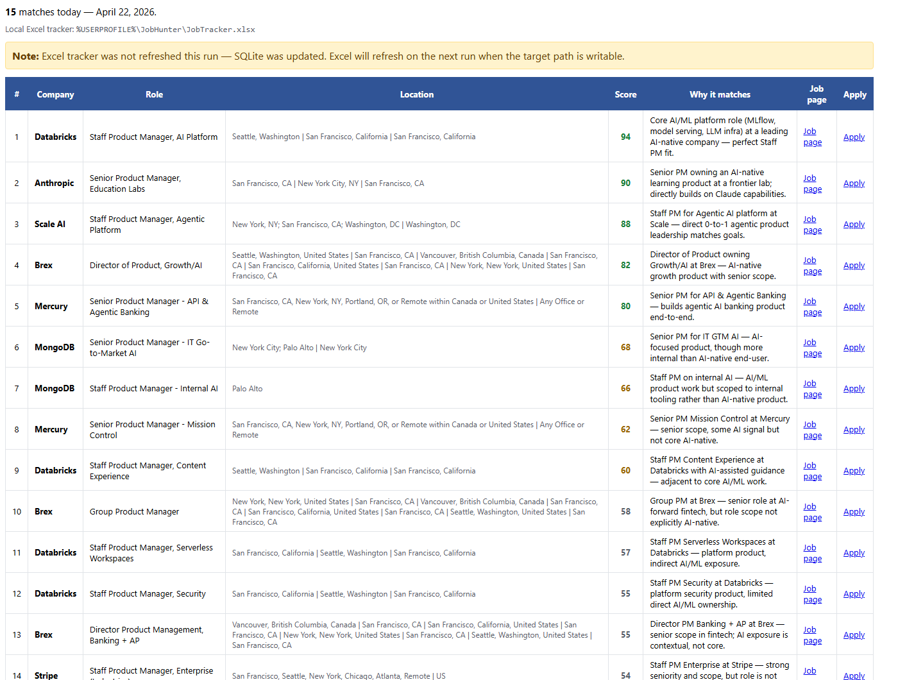
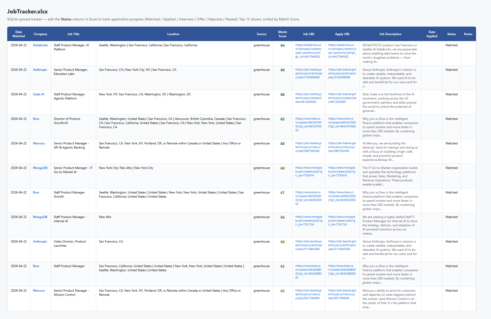

# pm-job-hunter

> Daily Senior+ PM AI/ML job hunter — fetches from Greenhouse, Lever, and Ashby public APIs, filters by level / location / AI signal, dedupes, LLM-reranks the top 30, exports a local Excel tracker, and emails an HTML digest every morning at 8 AM.

Built as an **Agency Copilot skill** (compatible with the [Agency Cowork](https://github.com/WilliamWang888/daily-ai-news) skill pattern). Designed to surface the **15 highest-fit Senior / Staff / Principal / Group / Director PM roles in AI / ML** every morning so you spend zero time scrolling job boards and all your time on tailored applications.

---

## Daily email digest

Lands in your Outlook inbox every morning at 8 AM, sorted by LLM fit score with one-sentence rationale, direct apply links, and color-coded scores (green ≥ 80, amber 60–79, gray < 60):



## Local Excel tracker

Auto-refreshed every run from the SQLite source of truth. Edit the **Status** column in Excel to track applications (`Matched` → `Applied` → `Interview` → `Offer`/`Rejected`/`Passed`); changes sync back via `sync_tracker.py`:



---

## What it does

Every morning at 8:00 AM local:

1. **Fetches** ~5,000+ open roles across **34 hand-picked AI companies** (frontier labs, AI product companies, AI infra, data platforms, dev tools, AI-forward fintech) from public ATS APIs — no scraping, no API keys required.
2. **Filters** to Senior / Staff / Principal / Group / Lead / Director / Head / VP **Product Manager** roles only, in **SF Bay / Seattle / NYC / Remote-US**, with **AI/ML signal** in the title or description.
3. **Dedupes** identical postings across multiple cities into a single row.
4. **LLM-reranks** the top 30 candidates against your `profile.yaml` (must-haves, nice-to-haves, target stage, etc.) and produces a 0–100 fit score plus a one-sentence rationale.
5. **Persists** everything to a local SQLite database and refreshes a clean **Excel tracker** with editable status columns (Applied / Interview / Offer / Rejected / Passed).
6. **Emails** you an HTML digest with a sortable table — score color-coded, direct apply links, why-it-matches blurbs.

Sample top 3 from a real run:

| # | Company    | Role                                  | Score | Why                                                                  |
|---|------------|---------------------------------------|-------|----------------------------------------------------------------------|
| 1 | Databricks | Staff PM, AI Platform                 | 94    | Core AI/ML platform role (MLflow, model serving, LLM infra)          |
| 2 | Anthropic  | Senior PM, Education Labs             | 90    | Senior PM owning AI-native learning product at a frontier lab         |
| 3 | Scale AI   | Staff PM, Agentic Platform            | 88    | Direct 0-to-1 agentic product leadership matches goals               |

---

## Why I built it

Job boards are a firehose of low-signal listings. As a Senior PM trying to move into AI-native product work, ~98% of "Product Manager" results were noise (Marketing PMs, Program Managers, Product Designers, Legal Counsel "Product"). I wanted a tool that respected my actual filters:

- **Seniority bar:** Senior+ only — no IC1/IC2 reposts
- **Domain:** must be **directly working on AI/ML products**, not "AI-adjacent" fintech
- **Geography:** SF / Seattle / NYC / Remote-US
- **No spam:** dedupe across multi-city listings, suppress jobs already seen yesterday

Existing aggregators don't get any of these right. This script does.

---

## Architecture

```
                ┌─────────────────────┐
                │   companies.yaml    │  ~34 companies × 1 ATS endpoint each
                └──────────┬──────────┘
                           │
                           ▼
         ┌─────────────────────────────────┐
         │   scripts/fetch_jobs.py         │  ThreadPool, 8 workers, 15s timeout
         │   greenhouse | lever | ashby    │
         └────────────────┬────────────────┘
                          │  raw_jobs.json (~5,600 jobs)
                          ▼
         ┌─────────────────────────────────┐
         │   scripts/pipeline.py           │  level + location + AI signal
         │   regex filter → fuzzy dedupe   │  rapidfuzz token_set_ratio ≥ 92
         │   → SQLite upsert               │  fingerprint = sha1(company|title)
         └────────────────┬────────────────┘
                          │  candidates.json (top 30)
                          ▼
         ┌─────────────────────────────────┐
         │   LLM rerank (Agency Copilot)   │  read profile.yaml + JD
         │   produces score 0–100 + why    │  → ranked.json (top 15)
         └────────────────┬────────────────┘
                          │
                          ▼
         ┌─────────────────────────────────┐
         │   scripts/finalize.py           │  persist scores, refresh Excel,
         │                                 │  emit digest.json
         └────────────────┬────────────────┘
                          │
                          ▼
         ┌─────────────────────────────────┐
         │   send-email skill              │  HTML digest → your Outlook inbox
         └─────────────────────────────────┘
```

**Why this split?** Heavy lifting (5,600+ HTTP calls, regex filtering, fuzzy dedupe, SQLite I/O, openpyxl) runs in deterministic Python — fast, debuggable, no LLM cost. The LLM only sees the **30 pre-filtered candidates** for nuanced ranking + email composition. End-to-end runs in **~7.5 min** scheduled.

---

## Repository layout

```
pm-job-hunter/
├── README.md
├── skill.json                          # Skill metadata (Agency Copilot)
└── skills/pm-job-hunter/
    ├── SKILL.md                        # 6-step workflow the agent follows
    ├── config/
    │   ├── companies.yaml              # 34 companies × ATS source + board_id
    │   └── profile.yaml                # Your must-haves, locations, AI keywords
    ├── scripts/
    │   ├── fetch_jobs.py               # Parallel ATS fetchers
    │   ├── pipeline.py                 # Filter + dedupe + SQLite persist
    │   ├── finalize.py                 # Score persist + Excel refresh + digest
    │   ├── sync_tracker.py             # Excel status → SQLite (manual sync)
    │   └── probe_boards.py             # Discover correct board_ids
    └── data/                           # Generated, gitignored
        ├── tracker.db                  # SQLite source of truth
        ├── JobTracker.xlsx             # Your editable application log
        ├── raw_jobs.json               # Latest fetch
        ├── candidates.json             # Pre-rerank
        ├── ranked.json                 # LLM scores
        └── digest.json                 # Email payload
```

---

## Configuration

### `config/profile.yaml` — your matching criteria

```yaml
profile_summary: |
  Senior PM (10+ yrs) targeting Staff/Principal AI-native product roles.
  Must be directly working on AI/ML products — not AI-adjacent fintech.
  Strong preference for frontier labs and AI infra (model serving,
  agents, LLM tooling, dev platforms).

target_locations:
  - San Francisco
  - Bay Area
  - Seattle
  - New York
  - NYC
  - Remote

ai_signal_keywords:
  - llm
  - foundation model
  - generative ai
  - agentic
  - rag
  - inference
  - ml platform
  - model serving
  - fine-tun

master_resume_path: ""   # v0.2 — leave empty for v0.1
```

### `config/companies.yaml` — the watch list

Each company maps to **one** ATS source. All 34 board IDs in the default config have been **live-probed** and confirmed to return jobs. To add a company:

1. Find its careers page → check the URL pattern:
   - `boards.greenhouse.io/<slug>` → `source: greenhouse`, `board_id: <slug>`
   - `jobs.lever.co/<slug>` → `source: lever`, `board_id: <slug>`
   - `jobs.ashbyhq.com/<slug>` → `source: ashby`, `board_id: <slug>`
2. Or run the probe utility:
   ```powershell
   python scripts/probe_boards.py "Stripe" "Notion" "Some New Co"
   ```
3. Add to `companies.yaml`. Done.

> **Big Tech (Google / Meta / MSFT / Amazon)** uses Workday, which doesn't expose a public list endpoint. Coverage of those is planned for v0.3.

---

## Usage

### Daily (scheduled — set this up once)

The skill registers itself with the Agency Copilot **task-scheduler**:

```
Task ID:  daily-pm-job-hunter
Schedule: 0 15 * * *   (UTC = 8 AM PDT)
Timeout:  15 minutes
```

Just leave your laptop on. The full pipeline runs and the digest lands in your inbox at 8 AM.

### On-demand (run it any time)

Invoke via Agency Copilot:

> *"run job hunter"* / *"find me PM jobs"* / *"refresh jobs"*

Or directly:

```powershell
& "<path>/task-scheduler/scripts/task-manager.ps1" run -Id daily-pm-job-hunter
```

### Sync your Excel edits back to SQLite

After you mark statuses (Applied / Interview / etc.) in `data/JobTracker.xlsx`, push them back:

> *"sync job tracker"*

Or:

```powershell
python scripts/sync_tracker.py --excel data/JobTracker.xlsx --db data/tracker.db
```

---

## Setup (from scratch on a new machine)

```powershell
# 1. Clone into your Agency Cowork skills directory
git clone https://github.com/WilliamWang888/pm-job-hunter.git "<Agency-Cowork>/skills/pm-job-hunter"

# 2. Install Python deps (Python 3.11+)
pip install openpyxl rapidfuzz pyyaml requests

# 3. Edit your profile
# <Agency-Cowork>/skills/pm-job-hunter/skills/pm-job-hunter/config/profile.yaml

# 4. Optionally edit company watch list
# <Agency-Cowork>/skills/pm-job-hunter/skills/pm-job-hunter/config/companies.yaml

# 5. Test end-to-end (without LLM/email — pipeline only)
cd "<Agency-Cowork>/skills/pm-job-hunter/skills/pm-job-hunter"
python scripts/fetch_jobs.py --config config/companies.yaml --out data/raw_jobs.json
python scripts/pipeline.py --raw data/raw_jobs.json --profile config/profile.yaml --db data/tracker.db --out data/candidates.json

# 6. Register the daily 8 AM (PDT) schedule
& "<Agency-Cowork>/skills/task-scheduler/scripts/task-manager.ps1" create `
    -Id daily-pm-job-hunter `
    -Name "Daily PM Job Hunter" `
    -Schedule "0 15 * * *" `
    -Timeout 15 `
    -Prompt "<see SKILL.md for the recommended scheduled prompt>"

# 7. Make sure the scheduler service auto-starts on login (one-time)
& "<Agency-Cowork>/skills/task-scheduler/scripts/task-manager.ps1" ensure-running
```

---

## Design decisions worth knowing

- **SQLite is the source of truth; Excel is a regenerated export.** If you have the Excel file open when the scheduler runs, the export is skipped (your edits are preserved) and the email notes "Excel will refresh next run". Status edits sync back via `sync_tracker.py`.
- **One ATS source per company** — we don't query Greenhouse + Lever + Ashby for everyone. Cuts HTTP volume by ~70%.
- **Fingerprint excludes location** so Brex's "Group Product Manager" listed in NYC + SF + Seattle + Vancouver collapses to one row with `"NYC | SF | SEA | YVR"`.
- **LLM only on the final 30** — never asked to score 5,600 raw jobs. Keeps each run cheap and fast.
- **No auto-submission. No scraping. No CAPTCHAs.** Hard-coded refusals in the skill rules. ToS compliance + your account safety > convenience.
- **No daily resume tailoring (v0.1).** Doc generation per match would blow the 15-min timeout and most generated docs go unused. v0.2 adds **on-demand** tailoring (`tailor <company>`) for the matches you actually want to apply to.

---

## Roadmap

**v0.2 (next):**
- On-demand `tailor <company>` → generates a tailored resume + cover letter for one match
- Click-tracking on apply links so you don't re-apply by mistake
- Optional Slack/Teams delivery in addition to email

**v0.3:**
- Workday adapter → Google, Meta, Microsoft, Amazon, Salesforce
- Compensation extraction (where disclosed)
- "Re-rank reasons changed" alerts for jobs you've already seen if the JD was edited

---

## License

MIT — use freely, fork happily.

---

## Credits

Built with help from **GitHub Copilot CLI (Claude Opus 4.7)** in an Agency Copilot session.
Inspired by the cognitive cost of repeated daily job-board scrolling.

Co-authored-by: Copilot &lt;223556219+Copilot@users.noreply.github.com&gt;
